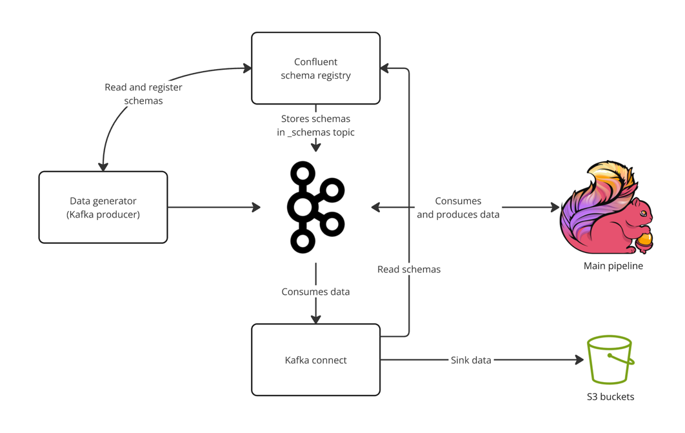
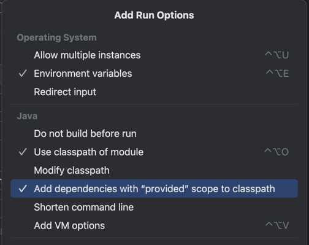
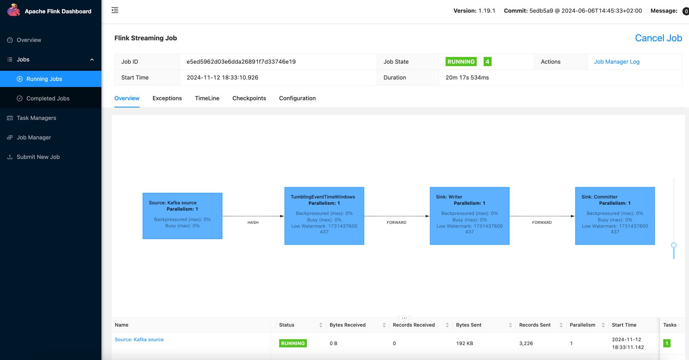

# example-flink-apps

## Overview

This project shows a local Flink pipeline to ingest Pageview data from Kafka, transform it to an aggregated stream, and
then use Kafka Connectors to run sink jobs to local S3 (localstack) as parquet files partitioned by process date. 

This diagram summarise what the project is implementing:

## Prerequisites

Setup IDE (IntelliJ), SBT and use **Java 11** for this project.

- Docker:
    - Recommended Docker runtime is Colima (but Docker/Rancher Desktop should also be fine, the code does handle this).
- If you use [colima](https://github.com/abiosoft/colima):
    - Start colima with network address `colima start --network-address`
        - After this, `colima ls -j | jq -r .address` should show an IP address from which we can use to ping the local
          containers

### Pipeline setup steps

Infra setup:

1. Once Docker, SBT and JDK has been setup. Run `make localdev-up` to spin up the local containers:
    - Kafka broker & zookeeper
    - Kafka Connect (for S3 sink)
    - Confluent Schema Registry
    - Localstack (for local S3 infra)
2. Once the containers are ready, run `make apply-localstack` to create the local S3 buckets in localstack

Run the pipeline:

3. Once infra has been setup, on a terminal window, run `make run-data-gen` to start the Pageview data generator
   process.
4. Navigate to the [PageviewAgg class](src/main/scala/com/viethungha/flink/examples/PageviewAgg.scala) and run it from
   IntelliJ. Since some dependencies are in the "provided" scope (as this is meant to be run on Kinesis Data Analytics),
   edit
   IntelliJ's run configuration to `Add dependencies with 'provided' scope to classpath` (screenshot below).
   
    - After this, the Flink application UI can be accessed via `localhost:12000`

5. Once the data generation and aggregation pipelines are running after a couple of minutes, we can create connectors to sink the Kafka data in
   S3, by running `make create-connectors`.
    - Note: in the Connectors config, you may notice that the batch size is quite small (100), this is just so that we
      can quickly see the files in localstack S3, in reality we want to increase this to avoid many small files.

See the file landing in localstack S3:

6. Seeing the data:
    - Raw pageview data -> Run `aws --endpoint-url=http://localhost:4566 s3 ls lakehouse-raw-bucket`
    - Aggregated pageview data -> Run `aws --endpoint-url=http://localhost:4566 s3 ls lakehouse-agg-bucket`

### Teardown environment
- Stop existing pipelines (Pageview data generation and aggregation), and then run `make localdev-down`

## Running this production
- Sink: 
  - Potentially use Iceberg Sink Connector (or implement the Sink logic in Flink directly) instead of S3 file
    landing (currently the sink is effectively creating a Hive tables)
  - Increasing batch size to avoid too many small files
- Streaming application
    - Dead letter queues mechanisms for main pipes (use Flink) using [side output](https://nightlies.apache.org/flink/flink-docs-master/docs/dev/datastream/side_output/)
    - Use a backoff retry strategy e.g. [Fixed Delay Restart strategy](https://nightlies.apache.org/flink/flink-docs-master/docs/ops/state/task_failure_recovery/#fixed-delay-restart-strategy)
    - Look into ways to avoid using [Kryo serializer](https://nightlies.apache.org/flink/flink-docs-release-1.17/docs/dev/datastream/fault-tolerance/serialization/types_serialization/#supported-data-types)
      - E.g. Java POJOs + Lombok instead of Scala case classes, etc.
- Deployment:
  - This can be run in [AWS Managed Flink service](https://aws.amazon.com/managed-service-apache-flink/), we just need to upload the built jar to S3.
- Monitoring and alerting:
  - Use Managed Flink CloudWatch metrics and Kafka metrics to monitor the following:
    - Consumer group lags (we can use Burrow or Kafka cluster's JMX metrics to know this)
    - Application restarts `fullRestarts`
    - Checkpointing - `lastCheckpointSize`, `lastCheckpointDuration`, `numberOfFailedCheckpoints`
    - Backpressure - `backPressuredTimeMsPerSecond`, `busyTimeMsPerSecond`
- Proper config passing via [KinesisAnalyticsRuntime](https://docs.aws.amazon.com/managed-flink/latest/java/how-properties.html#how-properties-access)
- Kafka authentication - instead of PLAINTEXT, use SASL/SCRAM, mTLS or MSK IAM authentication (if Kafka cluster is MSK). For any other AWS services, use IAM roles.
- Automation:
  - CI/CD pipeline: build/assemble the pipeline Jar, upload onto S3, and then call the required AWS managed flink API to use this new Jar instead
